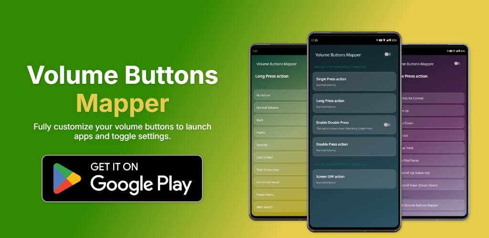

# Volume Buttons Mapper 🎛️✨

<div align="center">
  
  <h3>Transform Your Physical Volume Keys into Powerful System Shortcuts</h3>

  [](https://developer.android.com)
  [](https://kotlinlang.org)
  [](https://m3.material.io)
  [](#privacy--accessibility-service-compliance)

</div>

---

## 📖 Overview

**Volume Buttons Mapper** is a premium, highly customizable Android application that empowers users to remap their physical volume buttons (Volume Up / Volume Down) to execute a wide array of advanced system actions, quick toggles, media navigation, and automated gestures.

Built with a state-of-the-art **Glassmorphic** aesthetic and adhering to modern Android development standards, the app offers robust accessibility integration while maintaining strict user privacy and Google Play compliance.

---

## 🌟 Key Features

### 🚀 Extensive Action Library (30+ Actions)

Remap your Volume Up and Volume Down keys independently to perform:

* **System Actions**: Lock Screen, Power Menu, Take Screenshot, Open Voice Command, Web Search.
* **Quick Toggles**: Wi-Fi, Bluetooth, Do Not Disturb (DND), Flashlight, Auto-Rotate, Auto-Brightness, Custom Brightness Levels (0%, 50%, 100%).
* **Media & Navigation**: Play/Pause, Next/Previous Track, Open Volume Control, and innovative **Doomscroll Gestures** (automated Swipe Up / Swipe Down).
* **App Shortcuts**: Launch Camera, Dialer, Browser, Settings, or any custom installed application.
* **Safety & Control**: Master Toggle Switch, Pause app for 10 seconds, Close All Apps.

### 🎨 Premium Glassmorphic UI & Dynamic Theming

Experience a fluid, modern user interface featuring real-time blur, vibrant gradients, and smooth micro-animations. Choose from 8 curated premium themes:

1. **Lush Green & Gold Gradient** *(Default)*
2. **Midnight Blue & Cyan Gradient**
3. **Purple Nebula & Violet Gradient**
4. **Crimson Sunset & Ruby Gradient**
5. **Emerald Dream & Teal Gradient**
6. **Solid Pitch Black** *(OLED Friendly)*
7. **Solid Dark Slate Gray**
8. **Solid Deep Navy Blue**

### 🔄 Dynamic App Branding (System Icon Switching)

Customize your app drawer and home screen presence! Directly from the premium dashboard, select your preferred app icon matching your theme. The app dynamically switches its system-level `activity-alias` and performs a clean restart sequence to apply changes instantly.

### 📳 Advanced Haptics & Real-Time Feedback

Configure custom haptic vibration feedback for every button press. Features a live interactive slider to test vibration intensity in real-time before saving.

---

## 📸 Screenshots & Previews

### 🌟 Feature Overview

<div align="center">
  
</div>

### 📱 Mobile Dashboard & Settings

|  |  |  |  |
| :----------------------------------------------------------------------------------------------------------------------------------------------: | :------------------------------------------------------------------------------------------------------------------------------------------------: | :-----------------------------------------------------------------------------------------------------------------------------------------------------: | :---------------------------------------------------------------------------------------------------------------------------------------------------: |
|  |  |        |      |

> *All high-resolution preview assets, logos, and promotional video recordings can be found in the [`assets/`](assets/) directory.*

---

## 🛠️ Tech Stack & Architecture

* **Language**: 100% [Kotlin](https://kotlinlang.org/)
* **UI & Styling**: AndroidX AppCompat, Material Components (`com.google.android.material:material:1.10.0`), ConstraintLayout, custom Glassmorphic XML drawables & state list animators.
* **Core API**: Android `AccessibilityService` API for secure, low-latency physical key event interception.
* **System Integration**: Dynamic `PackageManager` component state management (`activity-alias`) for live app icon switching.
* **Preferences**: AndroidX Preference KTX / SharedPreferences for persistence.
* **Build System**: Gradle Kotlin DSL (`build.gradle.kts`).

---

## 🔒 Privacy & Accessibility Service Compliance

**Volume Buttons Mapper** requires the Android Accessibility Service permission strictly to detect physical volume button presses and execute the user's configured shortcut actions.

### Google Play Policy Compliance:

* **Explicit Informed Consent**: Includes a prominent, dedicated disclosure dialog prior to requesting permissions, explaining exactly why the service is needed.
* **Zero Data Collection**: The Accessibility Service does **NOT** collect, store, log, or transmit any personal data, screen content, or user interactions.
* **Proper Metadata**: Configured with `android:isAccessibilityTool="false"` in accordance with Google Play requirements for non-assistive key remapping tools.

---

## 💻 Getting Started (Local Development)

### Prerequisites

* **Android Studio**: Ladybug / Koala (or newer) recommended.
* **Android SDK**: Target SDK 35 (Minimum SDK 28 / Android 9.0+).
* **JDK**: Java 17 / Java 11.

### Installation & Build

1. **Clone the repository**:

   ```bash
   git clone https://github.com/yourusername/VolumeButtonsMapper.git
   ```
2. **Open the project** in Android Studio.
3. **Sync Gradle** to download required AndroidX and Material dependencies.
4. **Build and Run**:

   ```bash
   ./gradlew assembleDebug
   ```

   Or click the green **Run** button in Android Studio to deploy to an emulator or physical device.

---

## 📁 Repository Structure

```
VolumeButtonsMapper/
├── app/
│   ├── src/main/
│   │   ├── java/risk/tech/volumebuttons/  # Core Kotlin source code
│   │   ├── res/                           # Layouts, Glassmorphic drawables, Values, XML configs
│   │   └── AndroidManifest.xml            # Manifest with activity-aliases & service config
│   └── build.gradle.kts                   # Module-level Gradle configuration
├── assets/                                # Promotional graphics, logos, screenshots, recordings
├── build.gradle.kts                       # Top-level Gradle configuration
├── settings.gradle.kts                    # Project settings & module inclusion
└── .gitignore                             # Git ignore rules for build artifacts & heap dumps
```

---

## 📄 License

This project is licensed under the [MIT License](LICENSE) - see the LICENSE file for details.
